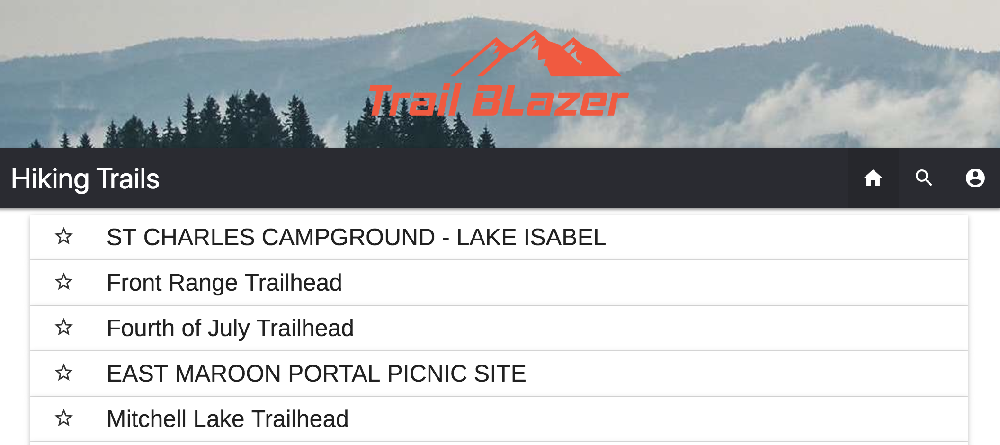

# **TrailBlazer**

### Purpose
Our application helps people who want to go on a hike find nearby trails and information about them.  We ended up having the idea to create TrailBlazer because all of us enjoyed hiking, but realized that there isn't really anywhere you can go to get a bunch of info about trails.  Sure, that info is out there, but you'd have to go through several sources to find it.  This prompted us to create a "one stop shop" for all of it. 

### Tools Used
   * JQuery
   * Materalize CSS
   * Firebase
   * Google Maps API
   * OpenWeather API
   * Recreation.gov APIs

By utilizing Materialize CSS, OpenWeather API, the Google Maps API, and the Recreation.gov API, we were able to create a mobile-friendly application that allows users to search for trails near them. Not only does it show nearby trails, but it also gives the user a brief description of that trail, as well as the weather conditions of it.  The work ended up being divided between us pretty evenly. Each of us tackled an API; Kelsey worked with weatherbit.io, Jesse did recreation.gov's API, and I (Brett) tackled Google Maps.  Jesse and Kelsey also did a lot of the front-end design work.

While creating this app, we ran into quite a few challenges. I, for one, ended up having quite a few problems getting the map to display exactly what I wanted it to. The "Find More Trails" button also proved to be pretty finicky.  I also know that Jesse had some problems getting the date selector to work, as well as look good; and Kelsey ended up running into some trouble with getting the star for the favorites button to work.  We also had quite a bit of trouble getting all of our code to merge together properly, and have it all work based on the same variables.  At the end of the day though, we ended up working pretty hard through these problems, ending up with an app that we're all proud of.

In the future, we'd like to add an account creation system that allows favorite trails to be saved server side. We'd also like to get a comment system working that would serve as a way to provide even more info about certain trails.  Implementing a "tagging" system would also greatly increase the accessability of our search feature.  We might try to pull in even more information through REI's trail API as well, greatly increasing the info that we'd be able to provide.

